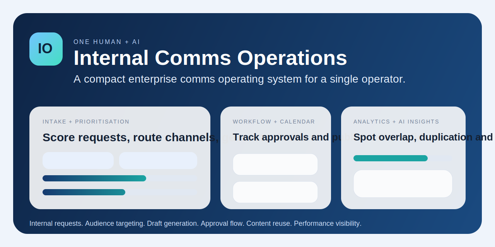
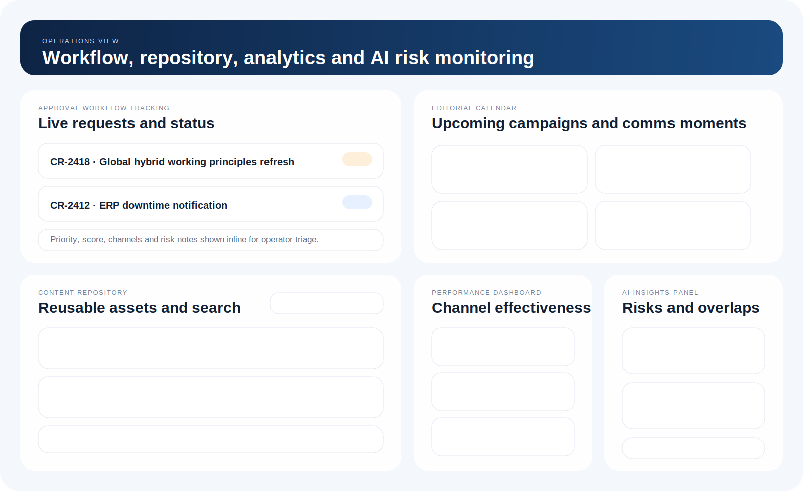

# Internal Comms Operations Dashboard

Enterprise internal comms operations for one human operator plus AI.

Live demo:
[internal-comms-ops-dashboard.vercel.app](https://internal-comms-ops-dashboard.vercel.app)

This project is a realistic enterprise dashboard that replaces much of the admin, coordination, drafting and triage load of a traditional internal comms team. It gives a single operator an AI-assisted control centre for request intake, prioritisation, drafting, approvals, calendar management, content reuse and performance monitoring.




## Proof Of Concept

This repo is built as a portfolio-ready proof of concept for a modern internal communications operating model.

It demonstrates how one experienced operator, supported by AI, can handle work that would traditionally be split across admin support, channel planning, drafting, editorial coordination and insight reporting.

## Demo Highlights

- Intake to draft in one flow: submit a request, score it, generate channel recommendations and create a full draft pack
- Believable enterprise operating model: approvals, editorial calendar, repository reuse and channel analytics all sit in one interface
- AI support where it matters: overlap detection, duplicate-content signals and likely employee question forecasting
- Designed for realism: large-enterprise language, plausible fake data and a UI that feels like an internal product rather than a quick mock-up
- Easy to run locally: lightweight Node server with no front-end build tooling required

## Portfolio Assets

- [Project Story](./PROJECT-STORY.md): narrative framing for portfolio links, applications or stakeholder sharing
- [Demo Script](./DEMO-SCRIPT.md): short and extended talk tracks for live walkthroughs or interview demos

## What It Does

- Captures new comms requests through a structured intake form
- Scores and prioritises requests by urgency, reach, risk and complexity
- Recommends likely audiences and best-fit channels
- Generates draft content for email, intranet, FAQ and manager brief formats
- Tracks approval workflow and current request status
- Shows an editorial and communications calendar
- Provides a searchable content repository with reusable assets
- Surfaces analytics for reach, engagement and FAQ deflection
- Highlights AI insights such as overlap risk, duplication and likely employee questions

## Prototype Highlights

- Clean enterprise-style UI designed for desktop and mobile
- Believable fake data across live requests, repository assets and performance metrics
- Fast local setup with no front-end build step
- Lightweight Node server for easy local running
- Interactive request submission flow that updates the dashboard state in real time



## Walkthrough

1. Start on the overview and review the live operating picture.
2. Submit a comms request through the intake form.
3. Watch the prototype generate a priority score and recommend audience and channel mix.
4. Switch between the draft tabs to review the AI-generated email, intranet, FAQ and manager brief outputs.
5. Move down the page to see how the request fits into workflow tracking, calendar planning, repository reuse, analytics and AI insight monitoring.

## Local Run

1. Create a local environment file:

```bash
cp .env.example .env
```

2. Add your AI key:

```bash
OPENAI_API_KEY=your_openai_api_key_here
OPENAI_MODEL=gpt-4o

ANTHROPIC_API_KEY=your_anthropic_api_key_here
ANTHROPIC_MODEL=claude-sonnet-4-20250514
```

3. Start the app:

```bash
npm start
```

Then open [http://localhost:3000](http://localhost:3000).

If no AI key is configured, the dashboard still runs in demo mode with built-in recommendation, draft and insight generation.

## Hosted Deployment

The public demo is deployed on Vercel with server-side AI generation so secrets stay off the client.

Set these project environment variables if you redeploy it elsewhere:

```bash
OPENAI_API_KEY=...
OPENAI_MODEL=gpt-4o

ANTHROPIC_API_KEY=...
ANTHROPIC_MODEL=claude-sonnet-4-20250514
```

## Project Structure

```text
.
├── public/
│   ├── app.js
│   ├── index.html
│   └── styles.css
├── assets/
│   ├── dashboard-overview.svg
│   └── dashboard-workflow.svg
├── .env.example
├── server.js
└── package.json
```

## Intended Use Case

This prototype is aimed at large enterprise internal communications teams that want to:

- reduce manual drafting and coordination overhead
- manage competing stakeholder requests with transparent prioritisation
- improve channel selection and audience targeting
- centralise reusable messaging assets
- give a single operator enough leverage to manage a broad comms portfolio with AI support

## Why This Matters

Internal comms teams often spend too much time chasing inputs, formatting drafts, managing stakeholder handoffs and duplicating content across channels. This concept shifts that workload into a compact operating layer so the human operator can focus on judgement, sequencing and message quality instead of admin drag.

## Next Good Enhancements

- save requests, drafts, approvals and repository assets to persistent storage
- role-based approvals and audit trail history
- export to Word, email and CMS formats
- integration with Teams, SharePoint or intranet tooling
- analytics fed by real campaign performance data

## License

This software is currently not licensed for commercial use. If you’d like to use this in a business setting or install it professionally, please contact me at cw4444@gmail.com
